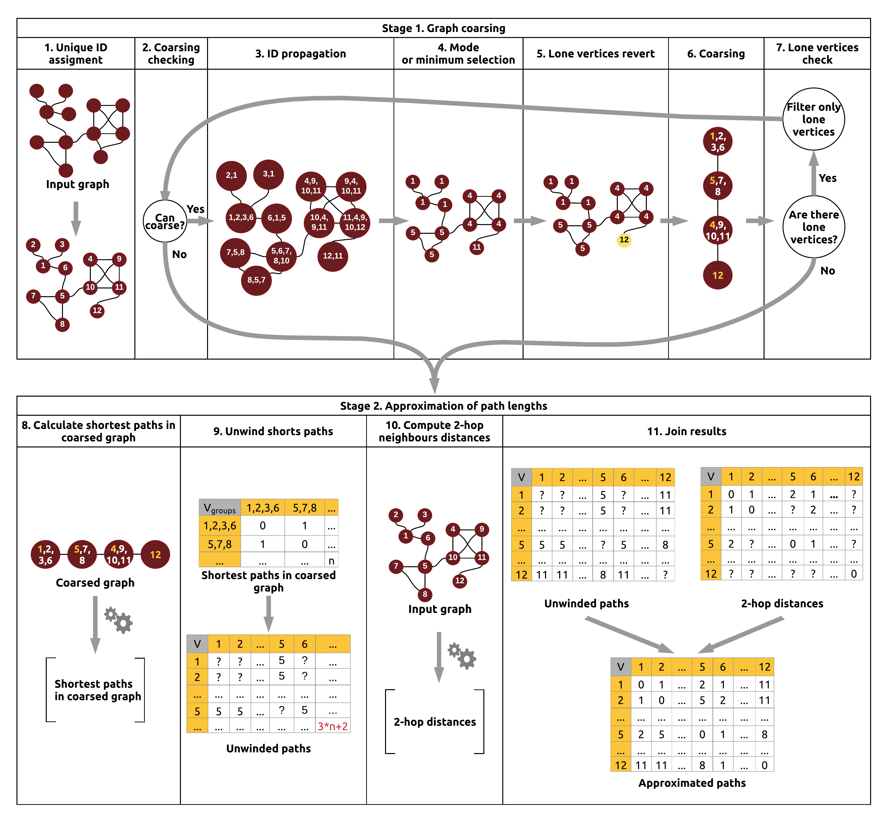

Shortest paths approximation
=============================

In order to limit computation time of shortest paths for large graphs, library gives ability to approximate them. Approximation can be divided into four main phases:

#. Graph coarsening
#. Paths calculation in coarsed graph
#. 2-hop neighborhood distances calculation
#. Paths approximation

Approximation gives worst-case result of 3*p+2 where p is real path. Result is not awesome in terms of beeing exact, but it keeps rankings of vertices and can be used for measures approximation (Closeness) or in tasks where order of vertices is important, not exact distance.

Alghotim block scheme
----------------------

Examples
----------------------

Alghoritm API lets to compute paths :

*	For single vertex:

	.. code-block:: scala
		
		import ml.sparkling.graph.operators.algorithms.aproximation.ApproximatedShortestPathsAlgorithm
		import org.apache.spark.SparkContext
		import org.apache.spark.graphx.{Graph, VertexRDD}

		implicit ctx:SparkContext=???
		// initialize your SparkContext as implicit value
		val graph = ???
		// load your graph (for example using Graph loading API)
		val sourceVertexId=1
		val graphWithPaths=ApproximatedShortestPathsAlgorithm.computeSingleShortestPathsLengths(graph,sourceVertexId)
		val paths : VertexRDD[Iterable[(VertexId, JDouble)]  =  graphWithPaths.vertices

*	For whole graph:

	.. code-block:: scala
		
		import ml.sparkling.graph.operators.algorithms.aproximation.ApproximatedShortestPathsAlgorithm
		import org.apache.spark.SparkContext
		import org.apache.spark.graphx.{Graph, VertexRDD}

		implicit ctx:SparkContext=???
		// initialize your SparkContext as implicit value
		val graph = ???
		// load your graph (for example using Graph loading API)
		val graphWithPaths =  ApproximatedShortestPathsAlgorithm.computeShortestPaths(graph)
		val paths : VertexRDD[Iterable[(VertexId, JDouble)]  =  graphWithPaths.vertices

*	using iterative approach:

	.. code-block:: scala
		
		import ml.sparkling.graph.operators.algorithms.aproximation.ApproximatedShortestPathsAlgorithm
		import org.apache.spark.SparkContext
		import org.apache.spark.graphx.{Graph, VertexRDD}

		implicit ctx:SparkContext=???
		// initialize your SparkContext as implicit value
		val graph = ???
		// load your graph (for example using Graph loading API)
		val bucketSize=10
		val graphWithPaths =  ApproximatedShortestPathsAlgorithm.computeShortestPathsLengthsIterative(graph, (g:Graph[_,_])=>bucketSize)
		val paths : VertexRDD[Iterable[(VertexId, JDouble)]  =  graphWithPaths.vertices

